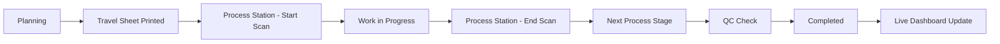

---

# 📊 Smart Travel Sheet Process Tracking System

### QR-Based Manufacturing Workflow Tracking System

---

## 🧭 Overview

This system is used to track manufacturing work processes using a **Travel Sheet linked with WSR (WorkShop Request)**.

It helps monitor job progress across multiple production stages, from planning until QC completion, using QR scanning at each process station.

The system records:

* When a process starts and ends
* How long each process takes
* Current status of each WSR
* Overall job progress in real time

Each WSR can go through multiple stages (up to 8 or more), depending on the job requirement.

---

## 🚨 Problem

Before this system, tracking was mostly done manually:

* PIC had to update job status verbally or through messaging
* Hard to know exact process timing
* No clear visibility of ongoing or stuck jobs
* QC completion was not immediately visible to design/requester team

Because of this, follow-up between departments was frequent and time-consuming.

---

## 💡 Solution

A QR-based tracking system was introduced where every job movement is recorded as an event.

Each WSR follows a simple flow:

> Planning → Production → QC → Completion

Every scan updates the system automatically, so no manual reporting is needed during the process.

---

## 🏗 System Flow

---

## ⚙️ Key Features

### 📌 1. Planning & Travel Sheet

* PIC prepares job planning
* Travel Sheet is generated and printed
* Includes:

  * WSR number
  * Process sequence
  * Job details and materials

---

### 📦 2. QR-Based Process Tracking

Each station uses QR scanning:

* **Start Scan** → process begins (timestamp recorded)
* **End Scan** → process completed (timestamp recorded)

System automatically calculates:

* Process duration
* Waiting / idle time (if any)

This repeats for every process stage.

---

### 🔁 3. Multi-Stage Process Support

* Supports multiple process stages per WSR
* Handles repeated processes if needed
* Each stage is tracked separately

---

### 🔍 4. QC Integration

* QC is the final stage
* Once QC is completed, system marks WSR as done
* Completion time is recorded automatically

---

## 📊 5. Work-In-Progress (WIP) Dashboard

The system provides a simple status view for all WSRs:

| Status              | Meaning                          |
| ------------------- | -------------------------------- |
| 🟢 Completed        | Job fully done including QC      |
| 🟡 Work In Progress | Job is currently being processed |
| 🔴 Idle             | No activity detected for the job |

---

### Why this matters

* Requester can see job status without asking PIC
* PIC can quickly identify stuck jobs
* Reduces unnecessary follow-ups between teams

---

## 📡 6. Live Monitoring

Once QC is completed:

* WSR is pushed to live dashboard
* System updates status in real time
* Design team gets notified that fabrication is done

This helps reduce delay in downstream work.

---

## 🖥️ 7. UI System (PySide6 + PyVisual)

The system includes a desktop interface built using **PySide6**, with UI components styled using **PyVisual**.

### Main UI sections:

#### 📊 WIP Dashboard

* Shows all WSRs in real time
* Color-coded status (Completed / WIP / Idle)

#### 📦 Process View

* Shows each process stage
* Start and end time per stage

#### 📡 Live Activity Feed

* Displays QR scan activity
* Shows QC completion updates

#### 📈 Basic Analytics View

* Process duration per stage
* Total time per WSR
* Idle time tracking

---

## 🧠 8. Additional Capability (Analytics)

The system also helps analyze performance over time:

* How long each process takes per WSR
* Which processes usually cause delay
* PIC workload and completion speed
* Workshop efficiency trends

This helps in understanding overall production capability, not just tracking jobs.

---

## 📈 Benefits

* Real-time job tracking without manual updates
* Clear visibility of WSR status at any time
* Better coordination between production and design teams
* Reduced dependency on PIC for status updates
* Accurate process time tracking per stage
* Easier identification of delays or bottlenecks

---

## 🎯 Use Cases

* Manufacturing production lines
* Fabrication workshops
* Engineering job tracking
* Multi-stage production environments
* Internal factory workflow monitoring

---

## 🔮 Future Improvements

* Mobile QR scanning app
* Better analytics dashboard for bottleneck detection
* AI-based delay prediction per process stage
* Integration with ERP/MES systems
* Cloud-based tracking and reporting

---

## 👨‍💻 Author

Developed as part of an internal manufacturing system improvement project focused on:

* Improving production visibility
* Reducing manual tracking
* Streamlining communication between departments

---

## 🧾 Summary

This system replaces manual production tracking with a simple QR-based workflow that gives real-time visibility of job progress from start to completion.

---
