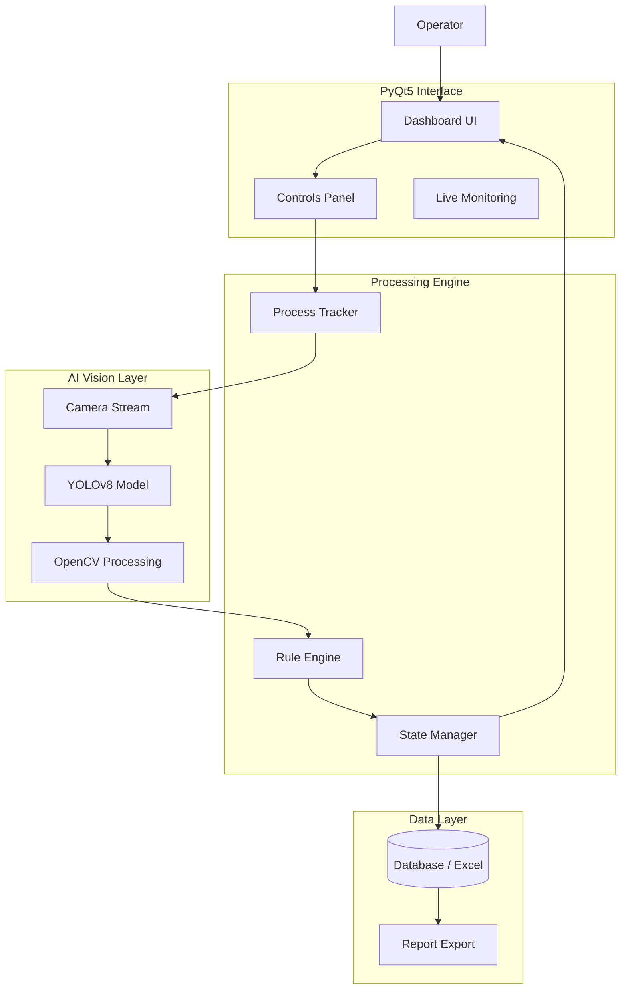

---

# ⚙️ PROCESS TRACKING SYSTEM

### Industrial AI-Driven Workflow Monitoring & Automation Platform

> A real-time process tracking system integrating computer vision, AI detection, and rule-based validation to digitize and optimize industrial workflow monitoring.

---

## 🎯 Project Overview

The **Process Tracking System** is an industrial-grade monitoring solution designed to replace manual process logging with an **automated, AI-assisted tracking pipeline**.

It combines:

* Computer vision (YOLOv8 + OpenCV)
* Real-time camera integration
* Rule-based validation engine
* Structured data logging and reporting

The system is built for **factory-floor environments**, where accuracy, speed, and reliability are critical.

---

## 🚨 Problem Statement

Traditional industrial process tracking suffers from:

* Manual data entry errors
* Delayed reporting cycles
* Lack of real-time visibility
* Inconsistent human judgment
* No structured validation system

### ⛔ Impact:

* Inefficient production monitoring
* High operational overhead
* Poor traceability of processes

---

## 💡 Proposed Solution

This system introduces an **automated digital tracking pipeline**:

### Key Idea:

> Replace manual process tracking with an AI-driven, event-based monitoring system.

It achieves this by:

* Capturing real-time process data via industrial cameras
* Detecting process states using **YOLOv8**
* Validating results using **rule-based logic**
* Logging structured outputs into databases / Excel reports

---

## 🏗️ System Architecture



---

## 🔁 System Workflow

1. **Camera Initialization**

   * Industrial camera stream activated
2. **Frame Acquisition**

   * Real-time image capture
3. **AI Detection**

   * YOLOv8 detects process states / objects
4. **Validation Layer**

   * OpenCV + rule-based verification
5. **State Management**

   * System determines final process status
6. **Logging**

   * Data stored in structured format (Excel/DB)
7. **Reporting**

   * Automated export for analysis

---

## 🧠 Key Features

### 🤖 AI-Powered Detection

* YOLOv8-based object/process recognition
* Optimized for real-time inference

### 📷 Industrial Camera Integration

* Supports Hikrobot / USB3 Vision systems
* Stable real-time frame acquisition

### 🧾 Rule-Based Validation Engine

* Reduces AI false positives
* Ensures industrial-grade reliability

### 📊 Automated Reporting

* Excel / CSV export
* Structured logging system

### 🔄 Real-Time State Management

* Live process tracking dashboard
* Instant status updates

### 🧩 Modular Architecture

* Fully separated AI, UI, and backend logic
* Easy to scale or extend

---

## 🧪 Technology Stack

| Layer              | Technology                 |
| ------------------ | -------------------------- |
| Language           | Python 3.10+               |
| AI Model           | YOLOv8                     |
| Computer Vision    | OpenCV                     |
| GUI                | PyQt5                      |
| Camera Integration | Hikrobot MVS / USB3 Vision |
| Data Logging       | Pandas / OpenPyXL          |
| Deployment         | PyInstaller                |

---

## 📈 Engineering Highlights

* ⚙️ Hybrid AI + Rule-Based Architecture
* 🔁 Real-time feedback loop system
* 📷 Industrial camera synchronization
* 🧠 Modular inference pipeline
* 📊 Automated reporting system
* 🛡️ Error-handling & validation layers

---

## 📦 Project Structure

```bash
PROCESS-TRACKING-SYSTEM/
├── main.py
├── code/
│   ├── GUI.py
│   ├── process_tracker.py
│   ├── camera.py
│   ├── yolo_infer.py
│   ├── rules_engine.py
│   └── state_manager.py
├── utils/
│   ├── logger.py
│   └── file_handler.py
├── data/
│   ├── logs/
│   └── reports/
└── models/
    └── best.pt
```

---

## 📊 Real-World Impact

* ⏱ Reduced manual tracking time by **~80–95%**
* 📉 Minimized human error in process reporting
* 📈 Improved production visibility
* 🔍 Enabled traceable process history
* 🏭 Designed for factory-floor deployment

---

## 🧭 Future Improvements

* Cloud-based centralized monitoring dashboard
* Multi-line production tracking support
* AI model retraining pipeline (active learning)
* Real-time alert system (anomaly detection)
* Mobile supervisor dashboard

---

## 👤 Author

**Qaisara Mardhiah**
GitHub: [https://github.com/qaisaraM](https://github.com/qaisaraM)
Portfolio: [https://qaisaram.github.io/PALLET-INSPECTION-SYSTEM](https://qaisaram.github.io/PALLET-INSPECTION-SYSTEM)

---

## 📜 License

This project is intended for educational and portfolio purposes.

---


